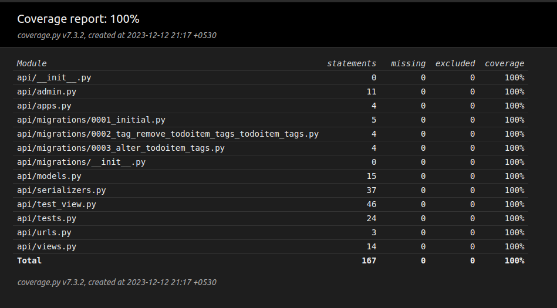

<h1 align="center">drf_Todo</h1>
<h4 align="center">Simple To-Do List REST API's with Django REST Framework, Unit & Integration tests with coverage and Github actions for basic CI/CD operations</h4>

<br>
<p align="center">
 <br><br>
<a href="https://www.python.org/" target="blank"></a>
<a href="https://www.djangoproject.com/" target="blank"></a>
</p>

### Project Setup :

Prerequisites
1. python3
2. pip3


3. Clone the project.

    ```shell
    git clone https://github.com/shashank725/drf_Todo
    ```
    

4. Create a virtual environment with venv (install virtualenv, if its not installed) inside the project floder.
  
    ```shell
    cd drf_Todo
    ```
  
   #### For Linux/Mac OSX
    ```shell
    sudo apt-get install python3-venv
    python3 -m venv env
    ```
  
   #### For Windows
    ```shell
    pip install virtualenv
    python -m venv env
    ```


5. Activate the virtual environemnt.

    #### For Linux/Mac OSX
    ```shell
    source env/bin/activate
    ```

    #### For Windows
    ```shell
    env\Scripts\activate
    ```
   
6. Install the requirements.

    ```shell
    pip install -r requirements.txt
    ```
 
7. Run the Migrations

    ```shell
    python manage.py makemigrations
    python manage.py migrate
    ```

8. Run the development server

    ```
    python manage.py runserver
    ```
9. Head to server http://127.0.0.1:8000

<br>

Superuser creds : `username:admin` `password:admin`

<br>

## Coverage Report :
<p align="center">
 
</p>

